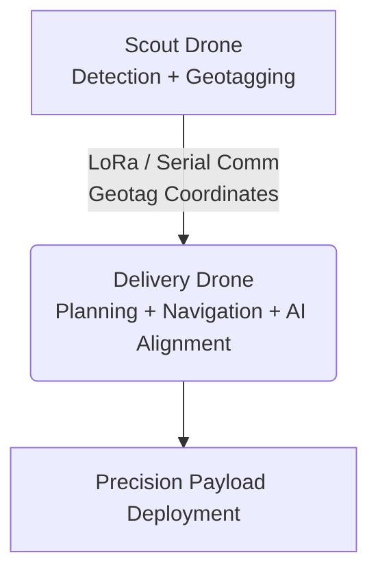

<div align="center">
  <h1> Autonomous Disaster Management Drone System</h1>
  <p><strong>Dual-drone autonomous system for rapid survey, reconnaissance, and precision payload delivery in disaster-stricken environments.</strong></p>
  
  [](https://www.python.org/)
  [](https://opencv.org/)
  [](https://ultralytics.com/)
  [](#)
</div>

---

##  1. Overview

This repository contains the complete software architecture, autonomous flight logic, and computer vision pipelines developed by **Team RAPTOR (ID: N250781)** for the **NIDAR Challenge 2025–26**.

Our solution is a **dual-drone autonomous system** designed to operate in disaster-stricken areas, enabling rapid and efficient assistance to stranded victims.

---

##  2. Problem Statement

During severe flooding in coastal regions, residents may become stranded on rooftops without access to essential supplies. 

###  Mission Objectives
-  **Scan:** Autonomously scan a **30-hectare disaster zone**.
-  **Detect:** Detect and geotag survivors using real-time vision.
-  **Deliver:** Deploy a delivery drone to **precisely drop 200g survival kits**.

---

##  3. System Architecture



---

##  4. Project Structure

```bash
NIDAR/
├── README.md
├── .gitignore
├── delivery_drone/           # Hexacopter payload delivery codebase
│   ├── main.py
│   ├── behaviours/
│   ├── models/
│   │   └── yolov8s_new.hef
│   └── data/
│       └── received_geotags.json
├── scout_drone/              # Quadcopter reconnaissance codebase
│   ├── scout.py
│   ├── geolocation.py
│   ├── models/
│   │   └── yolov8s_visdrone.pt
│   └── mission_files/
│       └── cricketground_full.kml
└── docs/                     # Architecture diagrams & documentation
    ├── architecture.png
    └── system_design.md
```

---

##  5. Key Features

###  5.1 Scout Drone (Reconnaissance & Geotagging)
* ** Automated Flight Path Generation**: Generates a lawnmower grid pattern from KML boundaries ensuring complete area coverage with minimal overlap.
* ** Real-Time Survivor Detection**: Utilizes YOLOv8s (VisDrone dataset) with BoT-SORT tracking. Features adaptive confidence scaling for distant targets and robust detection to minimize false positives.
* ** Smart Geotagging**: Uses trigger-based detection (bottom-frame zone) to ensure near-vertical alignment for accurate GPS tagging. Filters duplicate detections using spatial thresholds.
* ** Communication Pipeline**: Transmits geotags in real-time via lightweight and reliable LoRa serial communication for long-range connectivity.

###  5.2 Delivery Drone (Planning & Payload Delivery)
* ** TSP-Based Path Optimization**: Groups geotags into batches based on payload capacity and uses a Traveling Salesman Problem (TSP) solver to minimize total flight distance and energy usage.
* ** Behavior Tree Autonomy**: Built using `py_trees` to robustly handle mission execution, safety checks, and fail-safe actions (e.g., RTL, payload checks).
* ** Precision AI Alignment**: Powered by a Hailo-8 AI Accelerator for real-time visual servoing using pixel error, dynamically adjusting the drone position for accurate targeting.
* ** Controlled Payload Deployment**: Servo-actuated payload release mechanism supporting sequential and safe delivery.
* ** Parallel Execution System**: Dual-threaded architecture with a control thread (flight logic) and communication thread (geotag reception) synchronized via a shared JSON blackboard.

---

##  6. System Components

### 6.1 Scout Drone (Quadcopter)
**Hardware:** Custom PLA + Carbon Fiber Frame | 920KV BLDC Motors + 1045 Propellers | Pixhawk 6C | NVIDIA Jetson Orin Nano | F9P GPS | LoRa Module | USB / SIYI Camera  
**Software:** Multi-threaded execution (Flight path generation, Detection & tracking, Geotag transmission)

### 6.2 Delivery Drone (Hexacopter)
**Hardware:** Custom Hexacopter Frame | 22000mAh 4S LiPo | Pixhawk Cube Orange+ | Raspberry Pi 5 + Hailo AI Hat | Here 3+ GNSS | SiK Telemetry | Pi AI Camera  
**Software:** Dual-threaded system (Control & Communication threads) with a shared JSON-based Blackboard System.

---

##  7. Tech Stack

- **Flight Control & Autonomy**: DroneKit Python, MAVLink (`pymavlink`), `py_trees` (Behavior Trees)
- **Computer Vision**: OpenCV, Ultralytics YOLOv8, Hailo GStreamer Pipeline
- **Hardware OS & Comm**: NVIDIA JetPack, Raspberry Pi OS, LoRa (`pyserial`)
- **Design & Validation**: Autodesk Fusion 360 (CAD), ANSYS (Static Structural Analysis)

---

##  8. Installation & Setup

### 8.1 Clone Repository

```bash
git clone https://github.com/UnceasingEagerness/Nidar-2025-26.git
cd Nidar-2025-26
```

### 8.2 Scout Drone Setup (Jetson Orin Nano)

```bash
cd scout_drone
pip install -r requirements.txt
```
> **Note:** Ensure YOLO weights are placed in `scout_drone/models/`

### 8.3 Delivery Drone Setup (Raspberry Pi 5)

```bash
cd delivery_drone
pip install -r requirements.txt
```
> **Note:** Ensure the Hailo runtime is installed, GStreamer plugins are configured, and the `.hef` model is placed in `delivery_drone/models/`

---

##  9. Usage

### 9.1 Run Scout Drone
Automatically generates the flight path, detects survivors, and sends out geotags.
```bash
cd scout_drone
python3 scout.py mission_files/PATH_TO_KML_FILE.kml
```

### 9.2 Run Delivery Drone
Automatically receives geotags, plans the optimal route, aligns via AI, and drops the payload.
```bash
cd delivery_drone
python3 main.py
```

---

##  10. Safety & Reliability
- **Return-to-Launch (RTL)** triggered on low battery or payload depletion.
- **Duplicate geotag filtering** and stable detection verification.
- **Robust communication** with an integrated ACK protocol.

---

##  11. Future Improvements
- Multi-target prioritization using confidence scoring.
- Swarm coordination between multiple scout drones.
- Improved control using PID-based alignment.
- Real-time mission monitoring dashboard.

---
